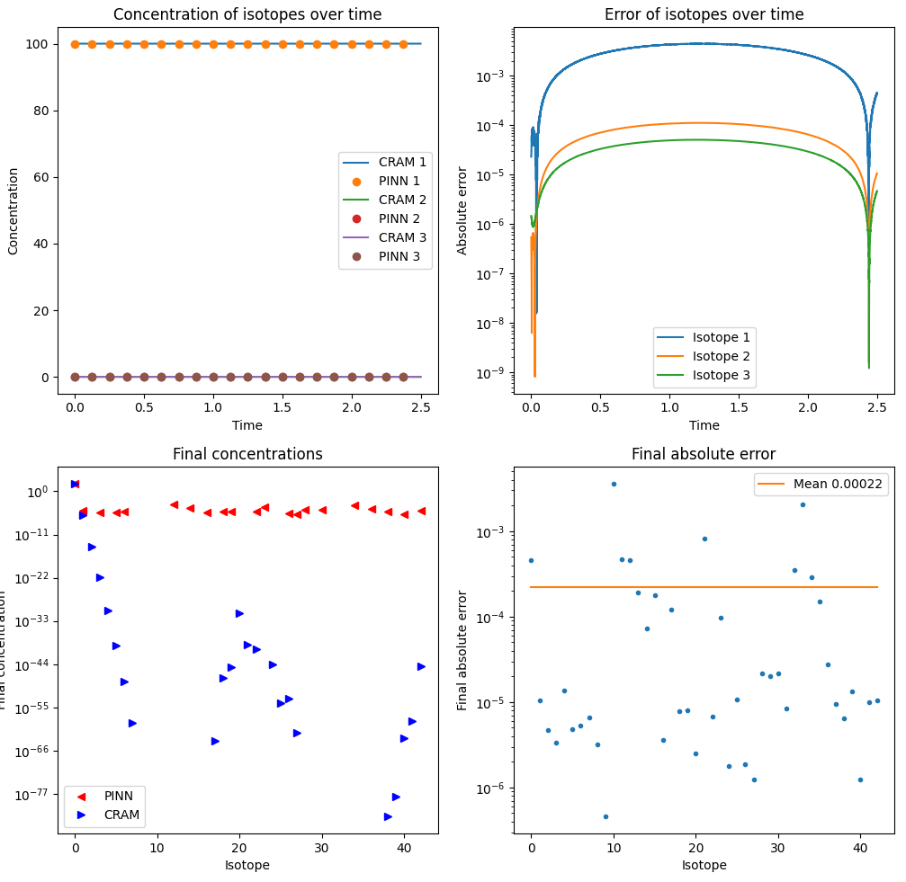
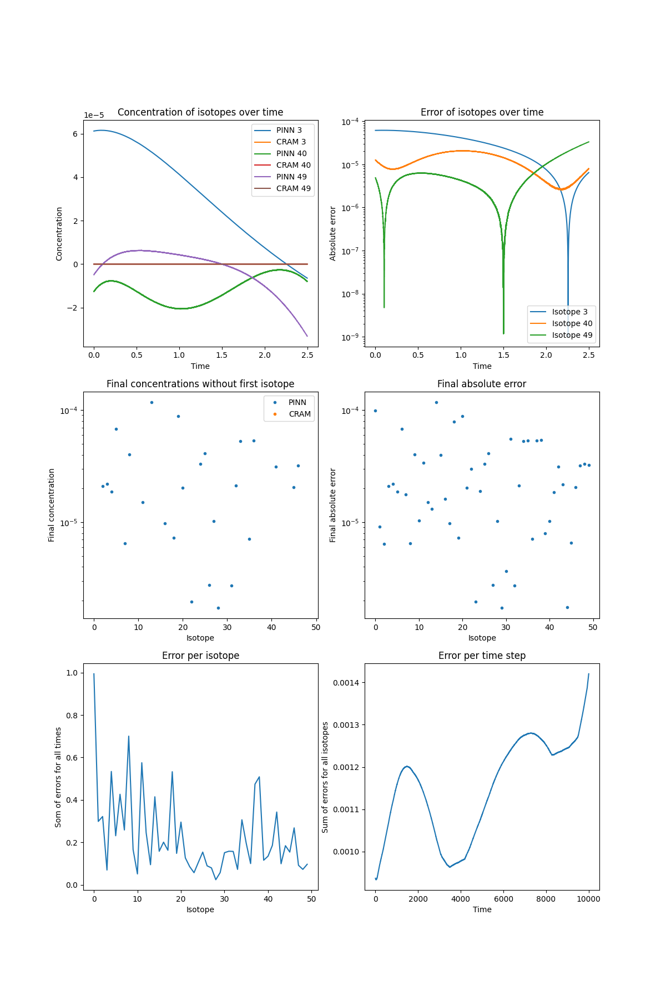
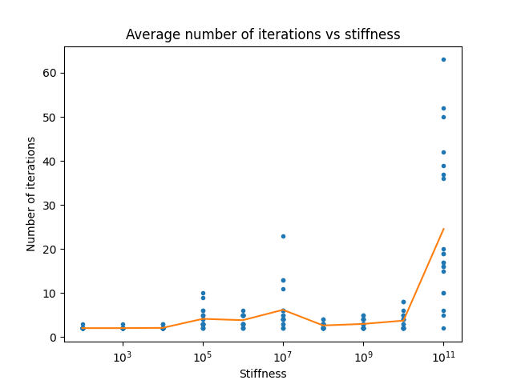
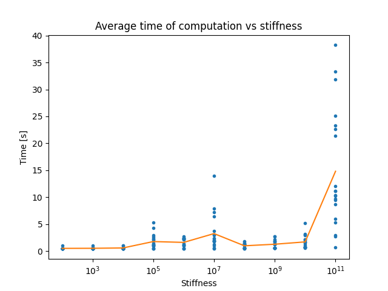
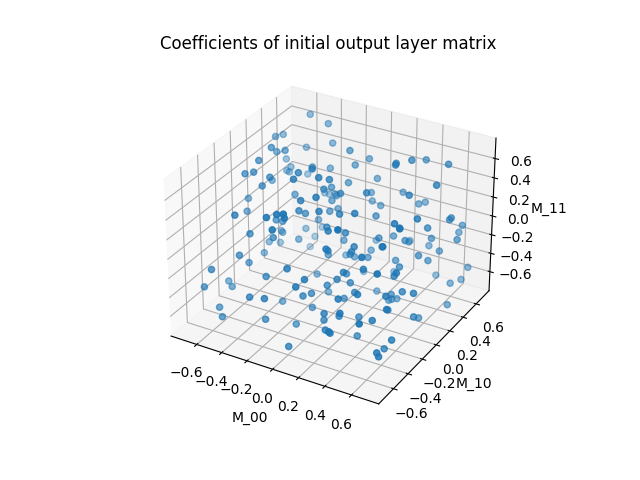
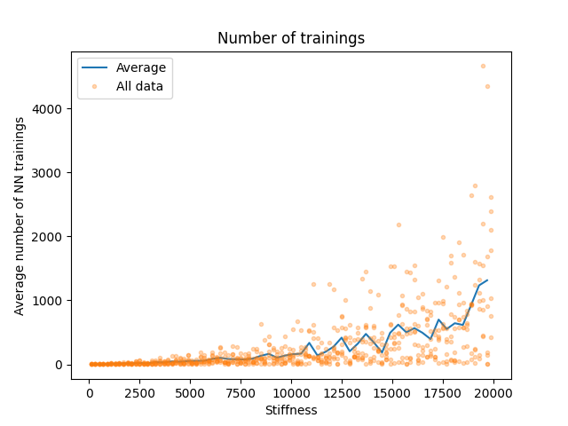
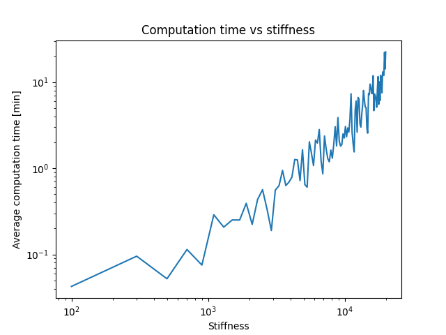
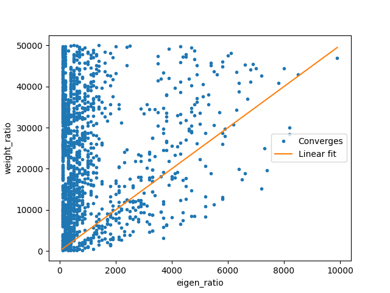
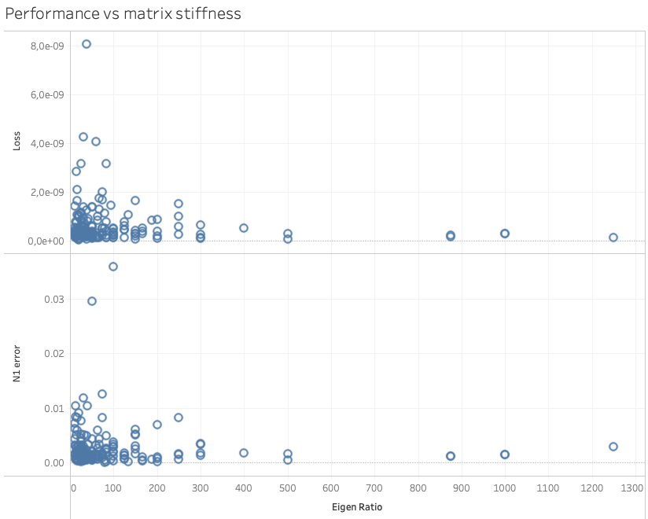
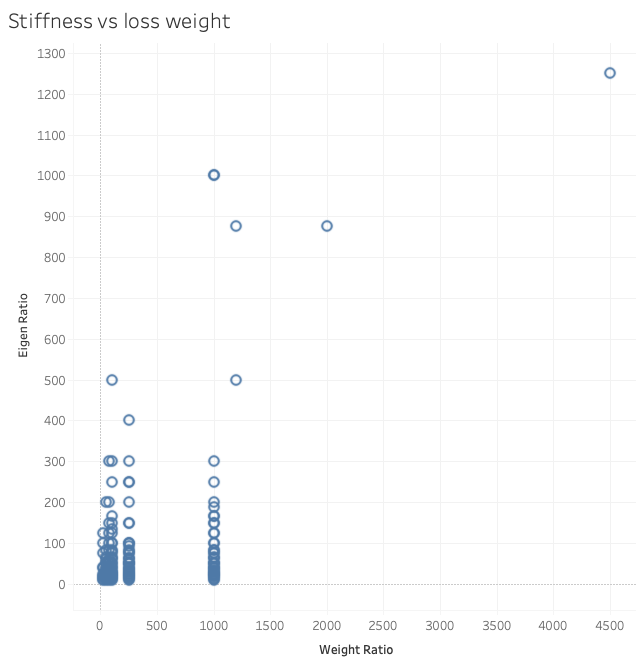

# Physics informed neural networks (PINN) with a mathematically informed architecture for the nuclear decay equation

Semester project of Miha Pompe with the goal to develop a novel mathematically informed architecture of a PINN to solve the nuclear decay equation. All the details and results are also published in ```PINN_presentation.pdf``` and ```PINN_report.pdf```.

Currently, the algorithm can solve problems with stiffness up to $10^{19}$ and up to any size (tested up to 500). Some results for test cases:
| Matrix size | Stiffness | Relative error | Relative final error |
|---|---|---|---|
|$17\times17$|$10^{30}$|0.79 %|0.94 %|
|$50\times50$|$10^{16}$|0.0009 %|0.0011 %|
|$100\times100$|$10^{18}$|0.13 %|0.23 %|
|$500\times500$|$8\times10^{24}$|54 %|63 %|

How to increase accuracy and performance:
- choose the lowest ```t_max``` and the highest ```t_steps```,
- choose the optimal weight ratio,
- decrease the absolute tolerance of the training,
- try different seeds.

## Problem description

Isotopic decay and transmutation is governed by the nuclear decay equation

$\frac{N(t)}{dt}=AN(t)$, with $N(t=0)=N_0$,

where $N \in R^n$ is the isotopic composition, $A \in R^{n×n}$ is the decay/transmutation matrix, and $n \in N$ is the number of isotopes. In common problems the number of isotopes is $n = 2000$ up to $n = 4000$, and $A$ is stiff, with up to $||A|| ∼ 10^{20}$. Furthermore $A$ is sparse and close to upper-triangular. Accurately solving the equation is notoriously hard due to the stiffness of the problem [1].

The decay equation is used in virtually all nuclear codes, both for simulation of reactor cores, and for radioactive decay in spent fuel. Thus, accurate and fast methods for the solution of the equation are very important for modelling reactors and for criticality safety of spent fuel repositories.

### Physics Informed Neural Networks

Physics Informed Neural Networks (PINNs) [2] offer a new paradigm for solving differential equations. The student Guclielmo Pacifico is exploring the viability of general-purpose PINNs for solving the nuclear decay equation. The neural network has input $t$ and output $N(t)$ and, in the one-layer case, can be written as

$N(t)=M\sigma (wt+b)$, with $M \in R^{n×n}, w, b \in R^n$,

where $\sigma(x)$ is a common activation function such as tanh or GELU. In this one-layer case the optimiser has to learn $2n + n^2$ parameters, and even more if the number of layers is increased. Furthermore, à priori one does not know how many neurons or layers will be required.

However, upon closer examination of the problem (1), it seems that there might exist networks of a specific architecture that are more adequate for the problem at hand. This project aims to explore these type of networks.

### Mathematically informed architecture

It is known [3] that if A has n distinct real eigenvalues, the solution to (1) is the linear combination

$N(t) = \sum_{i=1}^n a_i e^{λ_it}$,

where $a_i \in R^n$ and $\{\lambda_i\}$ are the eigenvalues of $A$. This solution can be reformulated as a neural network with a hidden layer of n neurons, an activation function $\sigma(x) = e^x$, and known weights of the first layer $w = (\lambda_1, \lambda_2, ..., \lambda_n)$. I.e. the solution can be written as

$N(t) = Mv$, with $v = (e^{\lambda_1t}, e^{\lambda_2t}, ..., e^{\lambda_nt})$.

This network architecture has the advantage that only n2 parameters need to be learned, and the exact required numbers of neurons and layers are known. Thus many hyperparameters are known in advance (whereas with regular neural networks tuning the hyperparameters is nontrivial).

### More complex matrices
Having n distinct eigenvalues is ensured with probability 1, but having only real eigenvalues is not. If some eigenvalues are complex, the solution is

$N(t)=\sum_{i=1}^n e^{Re(\lambda_i)t}cos(Im(\lambda_i)t)a_i +e^{Re(\lambda_i)t}sin(Im(\lambda_i)t)b_i$,

with $a_i, b_i \in R^n$. This solution can also be represented as a neural network, with more neurons and a slightly different activation function.


## How to setup and run the project
First clone the repository

    git clone https://github.com/mihapompe/PINN-Nuclear-decay-equation

Move into the repository and create a virtual environment with all the necessary libraries. Change environment name PINN to whatever.

    conda create --name PINN python=3.9
    conda activate PINN
    pip install -r requirements.txt

To exit the virtual environment

    conda deactivate

To run a test code write

    python test_configuration.py


## Code structure
- ```test_configuration.py``` Example of how to solve a burnup or decay problem.
- ```Bateman_PINN.py``` Code that defines PINN classes and its associated functions.
- ```CRAMsolve.py```, ```RKsolve.py```, ```SineCosineLayer.py``` contain functions and classes used by ```Bateman_PINN.py```
- ```analysis/``` folder with python notebooks for running analysis
- ```report/``` folder with project statement, report and presentation.
- ```results/``` folder with all the graphs and results.


## Progress report

### Week 14
- Impact of different optimizer parameters on the default test case. By choosing the optimal parameters we can decrease the relative final loss by 25 %.

|final rel error    | learn rate  |```max_iter```   | ```tol_grad``` |
|---|---|---|---|
|0.003269 %         | 0.1        | 20         | 1e-7|
|0.004371 %         | 0.01       | 20         | 1e-7|
|0.003705 %         | 0.1        | 50         | 1e-7|
|0.007665 %         | 0.01       | 50         | 1e-7|
|0.003688 %         | 0.01       | 100        | 1e-7|
|0.01109 %          | 0.001      | 100        | 1e-7|
|0.004873 %         | 0.001      | 1000       | 1e-7|
|0.003642 %         | 0.1        | 100        | 1e-7|
|0.003642 %         | 0.1        | 100        | 1e-8|
|0.003642 %         | 0.1        | 100        | 1e-9|
|0.001813 %         | 0.1        | 100        | 1e-10 (tol_change)|
|0.001573 %         | 0.1        | 100        | 1e-11 (tol_change)|
|0.001573 %         | 0.1        | 200        | 1e-11 (tol_change)|
|0.002994 %         | 0.01       | 200        | 1e-11 (tol_change)|
|0.0009489 %        | 0.2        | 200        | 1e-11 (tol_change)|
|0.001501 %         | 0.5        | 200        | 1e-11 (tol_change)|
|0.0009489 %        | 0.2        | 100        | 1e-11 (tol_change)|
|0.001008 %         | 0.2        | 20         | 1e-11 (tol_change)|
|0.0007994 %        | 0.2        | 100        | 1e-12 (tol_change)|
|0.0007585 %        | 0.1        | 100        | 1e-12 (tol_change)|
|0.0007585 %        | 0.1        | 100        | 1e-12 (tol_change) 1e-9 (tol_grad)|

**RESULT**: The biggest impact it caused by lowering the ```tolerance_change``` and then by slightly increasing ```max_iter``` and sometimes learning rate.

### Week 13
- Finalizing the code, report, and documentation.
- Test the use of CRAM48

    **RESULT**: final relative error went from 3.269e-5 (CRAM16) to 3.269e-5 (CRAM48). CRAM16 time 14.45s, CRAM48 time 49.74s

- Testing the use of ```float32``` and ```float64```

    **RESULT**: ```pytorch linear``` supports only ```float32```, final relative error was 3.269e-5 (time 19.4s). I then tried implementing the linear layer manually, with datatypes set to ```float32``` final relative error was 6.74e-5 (time 31.7s), with ```float64``` final relative error was 4.619e-4 (time 44.15 s). All for default test case. Then I tested default test case with stiffness $10^{22}$. ```torch.linear``` error 1.081 (time 156s, 50 epochs), ```float64``` error 2.57 (time 228s, 50 epochs), ```float32``` error 2.52 (time 163s, 50 epochs). At large stiffnesses the model performs bad even with higher numerical precision.

- Testing gradual increase past stiffness $10^{20}$. (Stiffness, final rel error) : (16, 3.2e-5), (17, 6.0e-2), (18, 1.3e-1), (20, 4.3e-1), (22, 1.06), (25, 3.49). Without the use of gradual increase the final relative error with stiffness $10^{22}$ was 1.081 which is only slightly worse than 1.06 which we achieved with this method. It is interesting that the final error is almost the same, but the loss for gradual increase is on the order $10^{-6}$, whereas without is on the order of $10^{2}$.

### Week 11 & 12
- Data analysis and making of graphs.
- Writing of the report.
- Making the presentation.

### Week 10
- Adjustable weight ratio. Tested different functions to lower the ratio:
    - Step function, lower the ratio after some epoch or at a certain ```IC_loss```.
    - Linear function, linearly decrease the ratio over some epochs than stay the same.
    - Geometric decrease, every epoch multiply the ratio by some quotient smaller than 1.
    All of these methods performed worse than just setting the ratio to a constant value.
- Writing the report and adding graphs, clean the code.
- Get new burnup matrices and analysis.

Burnup matrix of size $43\times43$ with stiffness |A| = 3, 1 × 1011 was cropped from dataset ENDFB71. The orange line represents the mean of the final error which is $2.2\times10^{-4}$. The total relative error is $8.2\times10^{−5}$. Computation time of CRAM was 15s and of the PINN was 126s (on CPU).

### Week 9
- Implement and test architecture to solve the burn-up problem.
    - Two implementations: first one with ```SineCosineLayer``` (complex) and the other one by combining two networks with ```SineLayer``` and ```CosineLayer``` (complex_duo)
    - The network is able to solve the decay problem ($50\times50$, stiffness $5\times10^{16}$, rel error $3.5\times10^{-6}$, time 332s) with higher accuracy but longer time.
- Change the initial conditions, set all the concentrations to 10.

    **RESULT**: Network performs equally well as with previous initial conditions (first isotope set to 100) and is able to adapt to the dynamics. (picture 102)

- New criteria for stopping the training, IC loss and ODE loss have to be below a certain threshold.
- Self-adjusting weights. Rule: when $log_{10}(IC_{loss}) - log_{10}(ODE_{loss}) >= 5$: weights = [1,1]

    **RESULT**: the rule outperformed [5,1] ratio, but was equivalent to [1,1] in terms of accuracy but slower in time.

### Week 8
- Trying different weight ratios (st = stiffness = $10^{18}$, 100x100 matrix)
    | Weight heuristic | Relative error | PINN time | Loss |
    |---|---|---|---|
    |5*st       | 11 %   |  37|$10^{-10}$|
    |5*st/$10^{2}$  | 12 %   |  30|$10^{-10}$|
    |5*st/$10^{4}$  | 12 %   |  38|$10^{-10}$|
    |5*st/$10^{6}$  | 12 %   |  29|$10^{-9}$|
    |5*st/$10^{8}$  | 11 %   |  39|$10^{-9}$|
    |5*st/$10^{10}$ | 10 %   |  30|$10^{-7}$|
    |5*st/$10^{12}$ | 10 %   |  71|$10^{-7}$|
    |5*st/$10^{13}$ | 8 %    |  94|$10^{-6}$|
    |5*st/$10^{14}$ | 8 %    |  101|$10^{-6}$|
    |5*st/$10^{16}$ | 4 %    |  131|$10^{-6}$|
    |10*st/$10^{17}$ | 3.1 %    |  195|$10^{-5}$|
    |5*st/$10^{17}$ | 3.4 %    |  205|$10^{-5}$|
    |5*st/$10^{18}$ | Didn't converge    |  /|/|

    **RESULT**: Bringing the weight ratio down to 10 to 100 reduces the relative error by an order of magnitude. Going too low can result in network not converging.

- Increase stiffness gradually Error stays roughly the same, decreases a bit, from 9.0 % to 8.2 %.
- Model analysis, drawing error and concentration plots, example given below.
- Initial tests on feeding the training data sequentially and not randomly.

    **RESULT**: Performs worse, relative error went from 2 % to 3 %.

- Implementing the paper ($50\times50$, ```t_max``` =2.5, ```t_steps``` = 10000, stiffness = $5\times10^{16}$)
    | Method | Weigh heuristic | Relative error | Relative final error | Notes |
    |---|---|---|---|---|
    | Normal | / | 2.67% | 4.14% | |
    | Gradual increase | / | 2.11% | 3.29% | |
    | Gradual increase | /$10^{10}$ | 2.42% | 3.68% | |
    | Gradual increase | /$10^{12}$ | 2.44% | 3.78% | |
    | Gradual increase | /$10^{14}$ | 0.11% | 0.24% | |
    | Gradual increase | /$10^{15}$ | 0.018% | 0.037% | picture conc_and_error_over_time90 |
    | Normal | /$10^{15}$ | 0.024% | 0.048% | picture conc_and_error_over_time91 |
    | Gradual increase no dilution | /$10^{15}$ | 0.016% | 0.040% | |
    | Slower gradual increase no dilution | /$10^{15}$ | 0.024% | 0.045% | |
    | Slower gradual increase | /$10^{15}$ | 0.015% | 0.035% | |
    | Slower gradual increase | 50 | 0.007% | 0.010% | conc_and_error_over_time92 |
    | Slower gradual increase | 5 | 0.0034% | 0.0028% | |
    | Slower gradual increase no dilution | 5 | 0.0048% | 0.0041% | |
    | Gradual increase | 5 | 0.0041% | 0.0022% | |
    | Slower gradual increase | 5 with positivity loss | 0.0046% | 0.0029% | conc_and_error_over_time93 |
    | Slower gradual increase | 5 with positivity loss x10 | 0.0054% | 0.0037% | |
    | Slower gradual increase | 1 | 0.0009% | 0.0011% | conc_and_error_over_time94 |
    | Slower gradual increase | /$10^{16}$ | 0.13% | 0.23% | With 100x100 matrix, stiffness $10^{18}$, picture 101, loss $10^{-5}$|
    | Slower gradual increase | /$10^{16}$ | 54% | 63% | With 500x500 matrix, stiffness $10^{24}$, loss $10^{-10}$, 38 min|
    
    Gradual increase means that given a training time interval [0, t_max] we slowly increase t_max, the number of data points is increasing. If it says no dilution it means that we always have the same number of data points, but still increase t_max with every epoch. The latter one is about 10% to 20% slower due to more training points.

    Here I also tested how the model performs if we add another loss that enforces that $N(t) > 0$, positivity_loss = $||N(t)|-N(t)|^2$. Tests have shown that no significant improvement is gained by adding this loss.

    Beware that the result, meaning the relative errors, fluctuate, since they are dependent on the random seed.

    **RESULT**: Adding gradual increases to t_max as mentioned in the paper (https://arxiv.org/pdf/2304.08289.pdf) has decreased the relative error by one to two orders of magnitude. 




### Week 7
- Permute matrix to lower triangular.
- Add fluctuations to same eigenvalues.

    **RESULT**: both of these changes did not impact the accuracy of the solution.

- Move the code to Merlin and run it on GPUs.


### Week 6
- Set the gradient of upper triangle to zero.
- Test the model on bigger matrices (without stiffness reduction)
    | Matrix size  | Stiffness | Relative error | PINN time | CRAM time |
    |---|---|---|---|---|
    | $5\times5$ | $5\times10^{8}$ | $5\times10^{-7}$ | 0.4 s | 12.8 s |
    | $12\times12$ | $10^{24}$ | 0.9 % | 0.7 s | 13.3 s |
    | $17\times17$ | $10^{30}$ | 1.8 % | 1.9 s | 13.4 s |
    | $100\times100$ | $10^{18}$ | 8.1 % | 29.5 s | 19.8 s |
    | $100\times100$ | $10^{10}$ | $5\times10^{-6}$ | 30.3 s | 23.4 s |
    | $500\times500$ | $8\times10^{24}$ | 54 % | 38 min | 3.5 min |


### Week 5
- Fix weights of initial layer.

    **RESULT**: We are able to solve problems up to at least $10^{12}$ stiffness. It also converges much quicker to the final solution. Most of the problems converge in one iteration, making it almost independent of the random seed value.

- Initial weights of the output layer are lower triangular.
- Tested Adam optimizer. It did not converge, even with different learning rates.
- Pass the values of the output layer matrix for a lower stiffness problem as initial values for stiffer problem. With that the problem was able to solve problem up to stiffness $10^{16}$, after that it becomes a problem with storing such large numbers.






### Week 4
- Implement and test the random seed method (run the algorithm with different seeds until it converges)

    **RESULT**: We are able to solve problems up to at least 20k stiffness.

- Import numerical solvers.





### Week 3
- Test the model on bigger matrices
- Test the modified IC loss function $L_{IC} = ||A(N(t=0)-N_0)||$. 

    **RESULT**: We still have a dependence on the weight ratio. With the same weight ratio the original loss function performed better than the new one.
- Perform a more broad and dense hyperparameter search

    **RESULT**: We found that it's best to initialize $w_{IC}/w_{ODE} = 5\times stiffness$.




### Week 2
- Implement the new architecture
- Test the new model on small matrices with varying stiffness

    **RESULT**: The new architecture is able to solve problems with stiffness up to 1250.
    
- Perform a hyperparameter search





### Week 1
- Reading papers and reports
- Administrative things
